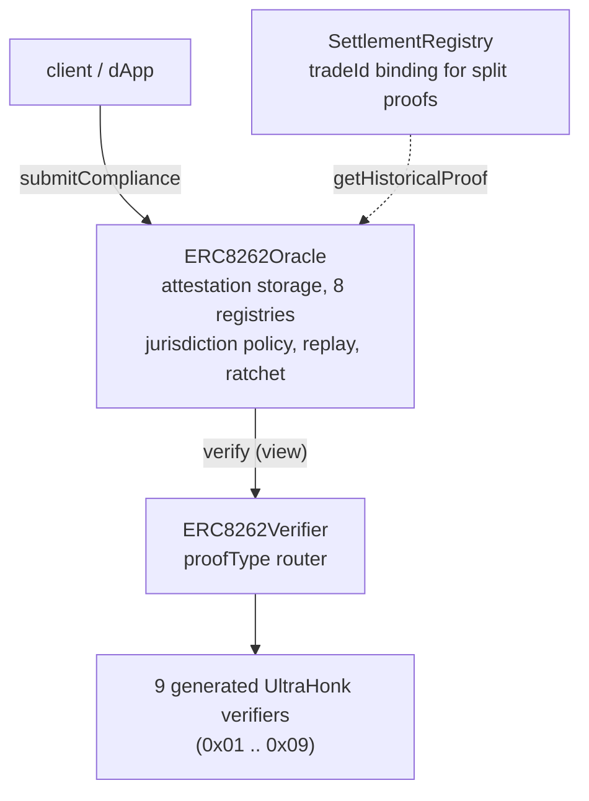

# ERC-8262: Zero-Knowledge Compliance Oracle

Reference implementation for [ERC-8262](https://github.com/ethereum/ERCs/pull/1747), a standard for zero-knowledge compliance proofs on Ethereum.

## What this is

A system where a user proves they're AML/sanctions-compliant without revealing any transaction data. The regulator verifies a ZK proof. They never see the trade.

This is distinct from view keys (Railgun, Panther) where you trade privately and then reveal transactions to auditors on request. ERC-8262 never reveals the data. Compliance is proven cryptographically at transaction time, not reconstructed after the fact.

## Proof types

| Type                | ID   | Assertion                          | What stays hidden   | Circuit                 |
| ------------------- | ---- | ---------------------------------- | ------------------- | ----------------------- |
| Compliance          | 0x01 | "Risk score below threshold"       | Signals, score      | compliance              |
| Risk Score          | 0x02 | "Score > X" or "Score in [X,Y]"    | Exact score         | risk_score              |
| Pattern             | 0x03 | "No structuring detected"          | Transaction history | pattern                 |
| Attestation         | 0x04 | "Valid credential exists"          | Credential details  | attestation             |
| Membership          | 0x05 | "Address in authorized set S"      | Which element       | membership              |
| Non-membership      | 0x06 | "Address NOT in sanctions list S"  | List contents       | non_membership          |
| Compliance (signed) | 0x07 | Compliance + provider sig          | Signals, score, sig | compliance_signed       |
| Risk Score (signed) | 0x08 | Risk Score + provider sig          | Exact score, sig    | risk_score_signed       |
| Compliance (M-of-N) | 0x09 | M of N independent providers agree | Per-provider data   | compliance_multi_signed |

Normative spec for each row (public/private inputs, validation rules, gas cost): [ERC-8262.md §Proof Types](ERC-8262.md#proof-types).

The signed variants verify a secp256k1 ECDSA signature in-circuit over the screening payload, so a user cannot submit fabricated signal values. The multi-signed variant (0x09) extends this to an M-of-N quorum across up to 5 registered signers, with a runtime `threshold_m`; US, Singapore, and UAE enforce a jurisdiction floor of M >= 2.

Per-jurisdiction policy in `JurisdictionConfig.requireSignedSignals` decides whether unsigned proofs are acceptable: US (BSA), Singapore (MAS), and UAE (VARA) require signed; EU (AMLD6) and UK (MLR) accept either.

The `signer_pubkey_hash` public input is validated against an on-chain registry (`registerSignerPubkeyHash`), so a compromised provider can be rotated without redeploying circuits.

## How it works

```
User's client fetches signed risk signals from screening providers
  -> Computes risk score locally (deterministic formula, published weights)
  -> Generates ZK proof (Noir circuit, UltraHonk backend) that:
       - Signal values were used (hidden)
       - Published weights were applied correctly (public config hash)
       - Score meets jurisdiction threshold (boolean: yes/no)
  -> Proof submitted on-chain to ERC8262Oracle
  -> Oracle routes to the correct UltraHonk verifier via ERC8262Verifier
  -> Attestation recorded on-chain (subject, jurisdiction, timestamp, proof hash)
```

The proof also commits to a timestamp and the screening providers used, enabling retroactive proof-of-innocence if a counterparty is later flagged.

## Architecture



Each of the 9 proof types has its own Noir circuit and generates a separate UltraHonk verifier contract via Barretenberg (`bb write_solidity_verifier`). The router holds the proofType → verifier mapping; the Oracle never calls a verifier directly.

## SettlementRegistry

Standalone immutable contract that links split settlement proofs to a tradeId (XIP-1). When a large trade is split into sub-trades for privacy, the registry records each sub-trade's compliance proof and enforces an anti-structuring pattern proof at finalization.

- No admin, no pause, no upgradability. Fully immutable.
- References the Oracle via `getHistoricalProof()` to validate proof existence.
- `recordSubSettlement` rejects any proof type other than COMPLIANCE / COMPLIANCE_SIGNED / COMPLIANCE_MULTI_SIGNED. Substituting a MEMBERSHIP, RISK_SCORE, ATTESTATION, or PATTERN attestation reverts with `NonComplianceProofType`.
- `finalizeTrade` binds the pattern proof to the specific settlement: the PATTERN circuit's `settlement_root` public input must equal `computeSettlementRoot(tradeId)` (keccak commitment over the recorded sub-settlement hashes, reduced into the BN254 scalar field). The same pattern proof cannot finalize two trades (`_usedPatternProofs`).
- Interface: `ISettlementRegistry`

## Repository structure

```bash
/
  Makefile                        # Build/test/lint targets (make help)
  foundry.toml                    # Foundry project config
  ERC-8262.md                     # The ERC document itself
  src/
    interfaces/
      IERC8262Verifier.sol        # Verifier interface (ERC standard)
      IERC8262Oracle.sol          # Oracle interface (ERC standard)
      IUltraVerifier.sol          # Interface for generated verifiers
      ISettlementRegistry.sol     # Settlement registry interface
    libraries/
      ProofTypes.sol              # Proof type IDs + public-input encoding/validation
      JurisdictionConfig.sol      # Per-jurisdiction thresholds + signed-signals policy
      AccessControl.sol           # GUARDIAN / REGISTRAR / CONFIG role split
      EIP712Attestation.sol       # EIP-712 typed data hashing for attestations
      EIP712CredentialRoot.sol    # EIP-712 typed data hashing for credential roots
      Ownable2Step.sol            # Two-step ownership transfer
      Pausable.sol                # Global + per-proof-type pause
    ERC8262Verifier.sol           # Verifier router (proofType -> generated UltraHonk verifier)
    ERC8262Oracle.sol             # Oracle: attestation storage, 8 registries, ratchet, replay
    SettlementRegistry.sol        # Immutable registry linking split settlement proofs to a tradeId
    Timelock.sol                  # 2-tier (24h HIGH / 6h LOW) selector-gated admin delay
    generated/                    # Auto-generated UltraHonk verifiers (do not edit)
  test/                           # Foundry tests (unit, fuzz, invariant, integration)
    Integration.t.sol             # End-to-end tests with real proofs
    Incident_VerifierSoundness.t.sol  # Soundness-bug runbook-as-code (audit F-7)
    fixtures/                     # Test proof fixtures (generated by scripts/generate-fixtures.sh)
    sdk/                          # TypeScript consumer SDK tests (noir_js + bb.js + anvil)
  script/
    Deploy.s.sol                  # Deployment script (verifier + oracle + 9 verifiers + optional timelock)
    Bootstrap.s.sol               # Post-deploy registry seeding (publishers, thresholds, merkle roots)
  scripts/
    generate-fixtures.sh          # Recompiles circuits + regenerates verifiers + proof fixtures
    patch-pairing-yul.sh          # Yul pairing rewrite for bb verifiers (EIP-170 + memory-safe)
    parity-check.py               # CI gate: circuit pub-input arity == Solidity expectations
  circuits/
    Nargo.toml                    # Workspace config (nargo compile/test --workspace)
    shared/                       # Shared Noir library
      src/lib.nr                  # Re-exports all modules
      src/hash.nr                 # Pedersen hash wrappers (hash2..hash32)
      src/merkle.nr               # Merkle root computation + domain tags
      src/risk.nr                 # Risk score + jurisdiction thresholds
      src/providers.nr            # Provider set commitment
      src/sig.nr                  # secp256k1 ECDSA helpers + signed-payload digest
      src/validation.nr           # Timestamp + tx-set hash validation
      src/constants.nr            # Shared constants (jurisdictions, depths, limits)
    compliance/                   # Compliance proof circuit (0x01)
      src/main.nr                 # Risk score below jurisdiction threshold
    compliance_signed/            # Signed-signals compliance (0x07)
      src/main.nr                 # Compliance + in-circuit secp256k1 ECDSA verify
    risk_score/                   # Risk score circuit (0x02)
      src/main.nr                 # Threshold and range proofs
    risk_score_signed/            # Signed-signals risk score (0x08)
      src/main.nr                 # Risk score + in-circuit secp256k1 ECDSA verify
    pattern/                      # Pattern detection circuit (0x03)
      src/main.nr                 # Structuring, velocity, round-amount analysis
    attestation/                  # Attestation circuit (0x04)
      src/main.nr                 # KYC tier, accreditation proofs
    membership/                   # Membership proof circuit (0x05)
      src/main.nr                 # Merkle inclusion proof for authorized sets
    non_membership/               # Non-membership proof circuit (0x06)
      src/main.nr                 # Sorted Merkle adjacency proof for exclusion
```

## Jurisdiction thresholds

Risk scores are in basis points (0-10000 = 0.00%-100.00%). Filing triggers
range from 6600 bps (US BSA, strictest) to 7600 bps (Singapore), with EU,
UK, and UAE all at 7100 bps. See the ERC
[§Jurisdiction Configuration](ERC-8262.md#jurisdiction-configuration)
for the normative table; the on-chain source of truth is
[`src/libraries/JurisdictionConfig.sol`](src/libraries/JurisdictionConfig.sol).

## Development

### Toolchain pinning

Pinned tool versions are in [`.tool-versions`](.tool-versions). Verify your local
environment matches before regenerating fixtures or generated verifiers:

```bash
make check-toolchain
```

Mismatched `nargo` or `bb` versions produce different VK_HASH values, which will
break the integration test suite and the on-chain verifiers. If your versions
are off, install the pinned versions:

```bash
noirup -v 1.0.0-beta.20    # nargo
bbup   -v 4.0.0-nightly.20260120   # bb
```

### Prerequisites

- [Foundry](https://book.getfoundry.sh/getting-started/installation) (forge, cast, anvil)
- [Noir](https://noir-lang.org/docs/getting_started/installation) (nargo >= 1.0.0)
- [Barretenberg](https://github.com/AztecProtocol/aztec-packages/tree/master/barretenberg) (bb)

### Setup

```bash
# Install Solidity dependencies
forge install

# Install TS SDK test dependencies (optional, for make test-sdk)
npm install

# Build everything
make build

# Run Solidity tests
make test

# Run all tests (Solidity + Noir + TS SDK)
make test-all

# See all targets
make help
```

### Circuit development

```bash
# Compile all circuits (workspace)
cd circuits && nargo compile --workspace

# Run all circuit tests (workspace)
cd circuits && nargo test --workspace

# Compile/test a single circuit
cd circuits/compliance && nargo compile
cd circuits/compliance && nargo test

# Generate witness (requires Prover.toml with inputs)
cd circuits/compliance && nargo execute

# Generate fixtures + verifier for a single circuit (recommended)
./scripts/generate-fixtures.sh compliance

# Generate fixtures + verifiers for all circuits
./scripts/generate-fixtures.sh
```

### Deployment

`script/Deploy.s.sol` deploys the verifier router, oracle, all nine generated UltraHonk verifiers, and (optionally) the timelock; it registers each verifier with the router and asserts post-conditions before exiting.

```bash
# 1. Required environment variables
export PRIVATE_KEY=0x...
export INITIAL_CONFIG_HASH=0x18574f427f33c6c77af53be06544bd749c9a1db855599d950af61ea613df8405
export INITIAL_PROVIDER_IDS=1,2,3   # comma-separated uint256s; weights for these IDs are committed to in INITIAL_CONFIG_HASH

# 2. Optional: deploy Timelock and transfer ownership to it (recommended for prod)
export USE_TIMELOCK=true
export TIMELOCK_PROPOSER=0x...   # multisig that schedules ops
export TIMELOCK_GUARDIAN=0x...   # optional cancel-only role

# 3. Deploy
forge script script/Deploy.s.sol --rpc-url $RPC_URL --broadcast \
    --sender $DEPLOYER_ADDRESS
```

**EIP-170 note.** The bb-generated UltraHonk verifiers used to land 64-65 B over the 24,576 B runtime limit. `scripts/patch-pairing-yul.sh` rewrites the `pairing()` free function in inline Yul (single `staticcall` to the bn254 precompile), saving ~186 B per verifier and ~800 gas per `verifyProof`. All 9 verifiers now sit at 24,453-24,455 B with +121-123 B headroom, deployable on Ethereum mainnet and the OP-Stack L2s without flags. The patch runs idempotently inside `scripts/generate-fixtures.sh`, so any regenerated verifier picks it up automatically. Confirm with `forge build --sizes` before broadcasting.

**Post-deployment ownership handoff (`USE_TIMELOCK=true`).** Deploy initiates `Ownable2Step.transferOwnership(timelock)` for both the verifier and oracle. To complete the handoff, the proposer multisig must drive each `acceptOwnership()` call through the timelock itself (no shortcut exists -- the permissive `acceptOwnership(address)` was removed in audit fix F-5):

```text
timelock.schedule(target, 0, abi.encodeWithSignature("acceptOwnership()"), salt)
# wait 24h (HIGH-tier delay)
timelock.execute(target, 0, abi.encodeWithSignature("acceptOwnership()"), salt)
```

Both schedules must be issued and executed within Ownable2Step's 48-hour acceptance window -- effectively a 24-hour scheduling window once the HIGH-tier delay is subtracted. Miss it and the deploy must be re-run.

**Post-deployment bootstrap.** Once ownership is on the timelock, seed the registries via `script/Bootstrap.s.sol`:

```bash
export ORACLE_ADDRESS=0x...      # from Deploy output
export REPORTING_THRESHOLDS=10000,5000
export MERKLE_ROOTS=0xabcd...,0x1234...
export PROVIDERS_JSON='[{"providerId":42,"publisher":"0xPUB..."}]'

forge script script/Bootstrap.s.sol --rpc-url $RPC_URL --broadcast --sender $ADMIN_ADDRESS
```

If timelock-owned, the admin must schedule each registry op through `Timelock.schedule(...)` and `execute(...)` rather than calling Bootstrap directly.

## Client-side proof generation

Proofs are generated client-side using `@noir-lang/noir_js` and `@aztec/bb.js`:

```typescript
import { Noir } from "@noir-lang/noir_js";
import { Barretenberg, UltraHonkBackend } from "@aztec/bb.js";
import circuit from "./circuits/compliance/target/compliance.json";

const api = await Barretenberg.new();
const noir = new Noir(circuit);
const backend = new UltraHonkBackend(circuit.bytecode, api);

// Private inputs never leave the client
const inputs = {
  signals: ["20", "30", "10", "0", "0", "0", "0", "0"],
  weights: ["50", "30", "20", "0", "0", "0", "0", "0"],
  weight_sum: "100",
  provider_ids: ["1", "2", "3", "0", "0", "0", "0", "0"],
  num_providers: "3",
  // Public inputs
  jurisdiction_id: "0", // EU
  provider_set_hash: "0x...",
  config_hash: "0x...",
  timestamp: "1700000000",
  meets_threshold: "1",
};

const { witness } = await noir.execute(inputs);
const proof = await backend.generateProof(witness, { verifierTarget: "evm" });

// Submit proof.proof and proof.publicInputs to ERC8262Oracle.submitCompliance()
await api.destroy();
```

A higher-level SDK is available at [`@xochi/sdk`](https://github.com/xochi-fi/xochi-sdk) with typed input builders and automatic validation.

## Retroactive flagging

Sanctions lists update continuously. An address clean at T=transaction may be flagged at T+90 days. Each compliance attestation records:

1. Which screening providers were queried (provider set hash)
2. The oracle's clearing decision (meetsThreshold boolean)
3. A timestamp binding the proof to that block
4. The full proof hash for retrieval via `getHistoricalProof()`

Counterparties retrieve the original attestation to demonstrate they couldn't have known. The proof is immutable on-chain.

## Deployments

_Testnet deployments pending. Mainnet after audit._

| Network      | Verifier | Oracle | Explorer |
| ------------ | -------- | ------ | -------- |
| Sepolia      | TBD      | TBD    | --       |
| Base Sepolia | TBD      | TBD    | --       |

## Related

- [ERC Draft](ERC-8262.md): the ERC-8262 specification
- [nahualli](https://github.com/xochi-fi/nahualli): vanity stealth key grinder for ERC-5564
- [ERC-5564](https://eips.ethereum.org/EIPS/eip-5564): stealth addresses (complementary)
- [ERC-6538](https://eips.ethereum.org/EIPS/eip-6538): stealth meta-address registry
- [Noir Language](https://noir-lang.org/): ZK circuit language by Aztec
- [Barretenberg](https://github.com/AztecProtocol/aztec-packages): UltraHonk proving backend

## Trust model

An ERC-8262 attestation is narrower than the word makes it sound. It proves a
specific computation ran on private inputs. It does not prove the inputs were
honest. Honesty either comes from somewhere else, or it is a gap you accept.

**What an attestation cryptographically guarantees:**

- The user ran the published circuit on private inputs.
- The result the circuit computed (e.g. `meets_threshold`, `is_member`,
  `is_non_member`) is the value those inputs actually produce under the rule.
- The proof is bound to the submitter's `msg.sender` (anti-frontrun).
- Replay-protection: a given proof can only be recorded once.
- For MEMBERSHIP, NON_MEMBERSHIP, and ATTESTATION, the proven element is
  cryptographically bound to the submitter in-circuit: leaves are computed as
  `leaf_hash_subject(submitter, set_id, salt)` (membership / non-membership) or
  `H(DOMAIN_CREDENTIAL, provider_id, submitter, type, attribute, expiry)`
  (attestation). A proof for one submitter cannot be replayed under another.
- For ATTESTATION, the credential leaf is included in a per-provider
  credentials Merkle tree. The provider's authorized publisher EOA registers
  each tree root via `publishCredentialRoot`; the Oracle binds the root to
  `provider_id` and enforces a 48 h TTL. A submitter cannot construct a valid
  proof without an inclusion path against a currently-registered root.

**What an attestation does NOT guarantee:**

- That the screening signal values are honest, for the unsigned variants.
  The unsigned COMPLIANCE (0x01) and RISK_SCORE (0x02) circuits accept
  `signals[]` as a private witness with no in-circuit provider signature.
  A user can enter all-zero signals and prove "low risk" without real
  screening. The `provider_set_hash` and `config_hash` commit to which
  providers and weights were used, not to what those providers actually
  returned.

  The signed variants close this gap mathematically. COMPLIANCE_SIGNED
  (0x07) and RISK_SCORE_SIGNED (0x08) verify a secp256k1 ECDSA signature
  over the screening payload in-circuit; the Oracle's
  `_validSignerPubkeyHashes` registry authenticates the signer's pubkey.
  Strict jurisdictions (US BSA, Singapore MAS, UAE VARA) reject the unsigned
  variants via `JurisdictionConfig.requireSignedSignals`; EU and UK accept
  either.
  The fix is mathematical, not operational: it is useful only when a real
  provider runs a signing daemon and registers their key. As of writing,
  no major AML provider (Chainalysis, TRM, Elliptic) does this. The
  primitive is shipped; adoption is not.

- That PATTERN proofs (0x03) ran on the user's complete transaction history.
  The circuit consumes a private `(amounts[], timestamps[])` array the user
  supplies. Nothing forces them to include every transaction. A user can
  cherry-pick clean transactions and prove "no structuring detected" against
  a curated subset. There is no provider analog of the COMPLIANCE_SIGNED
  fix here today: tx-history attestation requires a provider category that
  signs full per-address chain history, which does not exist yet. Treat
  PATTERN proofs as evidence about the disclosed subset, not the user's full
  activity. SettlementRegistry's `finalizeTrade` inherits this gap.

- That the off-chain credential issuance was honest. The on-chain side
  is locked down: the credential root is signed by a provider key (held
  separately from the publisher EOA) and the Oracle verifies the EIP-712
  signature via `ecrecover` at `publishCredentialRoot` time. A compromised
  publisher cannot mint forged credentials. What remains is the off-chain
  question of whether the provider's screening process actually verified
  what the credential claims. That trust does not move on-chain, ever.

- That the user's identity is private. Every attestation is linked on-chain
  to a submitter EOA in cleartext. Chain analysis correlates submitter EOAs
  across attestations and against the rest of an address's activity. What
  this system protects is the score, the signals, the credential attribute,
  and the merkle path; it does not protect _who_ is being scored. Integrators
  who need user-identity privacy must layer ERC-5564 stealth addresses,
  mixers, or trusted relayers on top.

Four trust models across the nine proof types. They do not compose
into a single "is this user compliant" answer. The signed variants close
signal honesty when a provider opts in. PATTERN remains self-attested.
ATTESTATION trusts a publisher EOA. Identity privacy is a separate layer
entirely. See `docs/THREAT_MODEL.md` for the cryptographic breakdown and
the practical limitations.

## Security

No external audit has been performed yet. Do not use in production.
If you find a vulnerability, email security@xochi.fi.

## License

Reference implementation: [CC0-1.0](LICENSE) (public domain).
